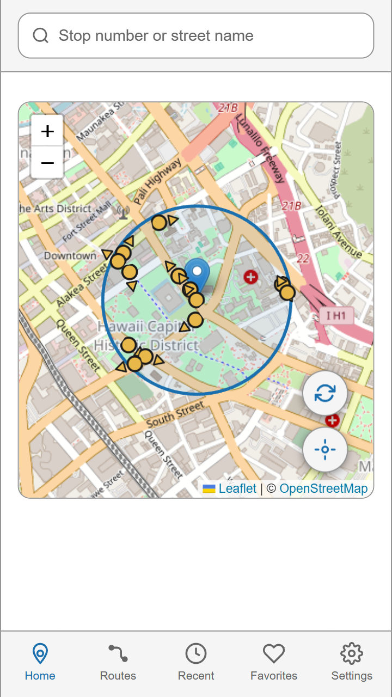
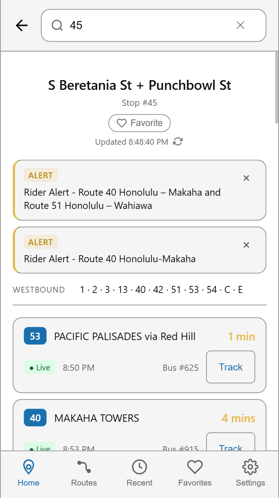
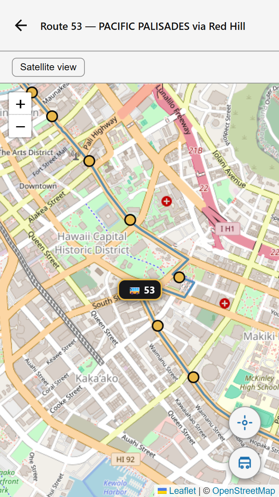

# Where Da Bus Stay?

A real-time tracker for Honolulu's TheBus, built for the riders who got left behind when the official DaBus2 app went away.

## Why this exists

In April 2026, Oahu Transit Services sunset the original DaBus2 app and pushed everybody to the Transit app instead. For a lot of riders, Transit doesn't work the way DaBus2 did — different layout, different feel, missing the things people relied on every morning at the bus stop.

This app is the answer for those folks. Real-time arrivals, nearby stops, live bus tracking, favorites, recents — built the way the old app worked, on the web so anybody on Oahu can use it from any phone.

**Live:** [where-dabus-stay.vercel.app](https://where-dabus-stay.vercel.app)

## Status

Personal project, actively in development.

**Working today:** real-time arrivals by stop number or street name, GPS-based nearby stops with directional arrows showing which way each bus travels, adjustable search radius, live bus tracking with route line and stop markers, favorites and recent stops (saved in your browser), full routes browser with stop lists, service alerts, PWA install ("add to home screen") with offline stop caching, responsive layouts for both phone and desktop.

**Still ahead:** trip planner for routing between two places.

## Screenshots


| Nearby stops | Live arrivals | Bus tracking |
|:---:|:---:|:---:|
|  |  |  |

## Tech stack

Frontend is React with Vite, maps via Leaflet through react-leaflet, styled with CSS Modules. Backend is a small Express server that proxies the OTS Web API (browsers can't call it directly) and indexes the GTFS static feed for stop and route lookups. Real-time arrivals and vehicle positions come from Oahu Transit Services' Web API at `api.thebus.org`; schedule, stop, and route data come from TheBus's GTFS feed.

Security: `helmet` for headers, `express-rate-limit` for abuse protection, CORS locked to an allowlist, input validation on every endpoint.

## Getting started

You'll need Node.js 20 or newer, [mkcert](https://github.com/FiloSottile/mkcert) for local HTTPS, and an OTS API key (register at [api.thebus.org](http://api.thebus.org)).

### Clone and install

```bash
git clone https://github.com/Aerokinesis/where-dabus-stay.git
cd where-dabus-stay/dabus-app
npm install
```

### Set up your environment

Create `dabus-app/.env`:

```
THEBUS_API_KEY=your_ots_api_key_here

# Optional — defaults cover local mkcert dev origins
# ALLOWED_ORIGINS=https://localhost:5173,https://192.168.x.x:5173

# Optional — override default mkcert cert paths
# SSL_KEY_PATH=./certs/key.pem
# SSL_CERT_PATH=./certs/cert.pem
```

### Download and preprocess the GTFS feed

The raw GTFS files are committed to the repo (needed for Railway deployment). If you need to refresh them:

```bash
cd dabus-app/data
curl -O https://www.thebus.org/transitdata/production/google_transit.zip
unzip -o google_transit.zip
rm google_transit.zip
cat feed_info.txt   # check the validity window
```

TheBus publishes a new feed every 4-8 weeks. After refreshing the raw files, regenerate `processed.json`:

```bash
cd dabus-app
node --max-old-space-size=4096 preprocess.js
```

This pre-computes route directions, shape polylines, stop sequences, and directional bearings so the server doesn't have to load 80+ MB of GTFS files at startup (important for Railway's 512MB memory limit).

### Generate local SSL certs

Browsers require HTTPS before granting geolocation access, so even local dev needs real certs. mkcert handles this:

```bash
cd dabus-app
mkcert -install                              # installs the mkcert root CA in your trust store (one time)
mkcert <your-LAN-IP> localhost 127.0.0.1     # e.g. mkcert 192.168.4.27 localhost 127.0.0.1
```

This produces `<ip>+2.pem` and `<ip>+2-key.pem`. Either rename them to match the defaults in `server.js`, or point `SSL_KEY_PATH` and `SSL_CERT_PATH` at them in `.env`.

### Run it

Two terminals, both in `dabus-app/`:

```bash
# Backend
node server.js
# Listens on https://localhost:3001

# Frontend
npm run dev
# Listens on https://localhost:5173 (or your LAN IP)
```

Open the frontend URL. On the first load you might get a "not trusted" certificate warning — that's mkcert behaving normally; running `mkcert -install` registers the cert with your browser's trust store and the warning goes away. If you hit it on a different browser or device, install the cert there too.

## Project layout

```
where-dabus-stay/
├── dabus-app/
│   ├── server.js              Express backend (CORS proxy + GTFS query layer)
│   ├── preprocess.js          One-time GTFS preprocessing script
│   ├── data/
│   │   ├── processed.json     Pre-computed route/shape/stop/bearing data
│   │   └── *.txt              Raw GTFS files (stops, trips, shapes, etc.)
│   ├── public/
│   │   ├── manifest.json      PWA manifest
│   │   ├── sw.js              Service worker (offline caching)
│   │   └── icon-*.png         PWA icons
│   ├── src/
│   │   ├── App.jsx            Top-level layout
│   │   ├── components/        UI components (map, arrivals, search, etc.)
│   │   ├── hooks/             Custom React hooks for state + data fetching
│   │   ├── index.css          Global tokens and resets
│   │   └── main.jsx           Vite entry point
│   ├── vercel.json            SPA routing config for Vercel
│   ├── railpack.json          Start command config for Railway
│   ├── package.json
│   └── .env                   (gitignored — your API key and config)
└── README.md
```

## Deployment

Frontend is hosted on **Vercel** (auto-deploys from `main`). Backend is hosted on **Railway** (set root directory to `dabus-app`).

**Railway environment variables:**

| Variable | Description |
|---|---|
| `THEBUS_API_KEY` | OTS API key |
| `USE_HTTPS` | Set to `false` — Railway handles TLS |
| `ALLOWED_ORIGINS` | Comma-separated frontend URLs (e.g. `https://where-dabus-stay.vercel.app`) |

**Vercel environment variables:**

| Variable | Description |
|---|---|
| `VITE_API_BASE` | Full Railway backend URL (e.g. `https://your-app.up.railway.app`) |

## Security

If you're forking this to run your own version, a few things to know:

- `.env`, `*.pem`, and the GTFS data files are gitignored — never commit your OTS API key or SSL private keys. If something slips through, regenerate the key right away and purge git history with `git filter-repo`.
- CORS defaults to localhost dev origins. Before deploying anywhere public, set `ALLOWED_ORIGINS` to your actual domain.
- The rate limiter caps `/api/*` at 60 requests per minute per IP. Adjust in `server.js` if your use case needs more.
- Every route param is validated before lookup — digit-only stop IDs, safe-id regex on shape/trip/route IDs, `hasOwnProperty.call(...)` guards against prototype-pollution lookups, regex-escaped search input.

## License

Personal project, not affiliated with OTS or TheBus. GTFS data and API access used under OTS's public Terms of Use.

## Mahalo

This app exists because Oahu riders deserve a way to check when da bus stay coming.
